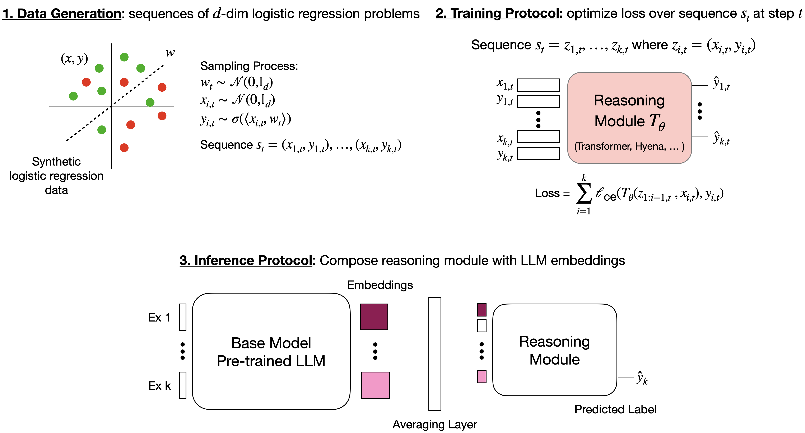

# TART: A plug-and-play Transformer module for task-agnostic reasoning

TART is a package for training and deploying task-agnostic reasoning modules which can be composed with arbitrary foundation models (text, audio, images, etc.) to improve in-conext learning peformance.

We introduce TART in our paper: TART: A plug-and-play Transformer module for task-agnostic reasoning. 

<div align="center">
    
</div>

Note: We are thankful to Garg et al., for their wonderful [repository](https://github.com/dtsip/in-context-learning), and acknowledge that we have adopted aspects of their code base.

## Getting started
You can start by cloning our repository and following the steps below.

1. Install the dependencies for our package using Conda. 

    ```
    conda env create -f environment.yml
    conda activate tart
    ```

2. Download [pre-trained TART Reasoning module](https://github.com/HazyResearch/TART/releases/download/initial_release/tart_heads.zip) (you will need this if you want to run the sample notebooks in `src/notebooks`)
    ```
    wget https://github.com/HazyResearch/TART/releases/download/initial_release/tart_heads.zip
    unzip tart_heads.zip
    ```

2. [Optional] If you plan to train TART reasoning modules, populate `conf/wandb.yaml` with you wandb info.

## Training a TART reasoning module
* All files needed for training a reasoning module can be found in `src/reasoning_module`. To train a reasoning module, use the following command:

    ```
    python src/reasoning_module/train.py --config src/reasoning_module/conf/tart_heads/reasoning_head_s258.yaml
    ```

* To customize the specifications of the TART Head (i.e., sequence length, training noise etc.), modify parameters in the config file: `reasoning_head_s258.yaml`.

## Playing with TART!
* Sample notebooks for deploying TART on image, text, and audio datasets can be found in `src/notebooks`. We provide more in-depth walk-throughs on the training process of the TART reasoning module and the inference time procedure of TART in `src/notebooks/tart-101`.
* We encourage first-time users to get familiar with TART via these sample notebooks!

## Evaluating TART
* All utilities needed to evaluate TART can be found in `src/eval`. In `src/eval/run_scripts`, we provide several bash scripts demonstrating how to evaluate TART on audio, image, and text tasks. We refer users to those scripts for more details. We provide our datasets (train / test splits) [here](https://drive.google.com/drive/folders/1vpcYogJS7g4hoGW8vjnuHwWRV6kOGF0V?usp=share_link).

# Maintainers
* Avanika Narayan (contact: avanika@cs.stanford.edu)
* Kush Bhatia (contact: kushb@cs.stanford.edu)
